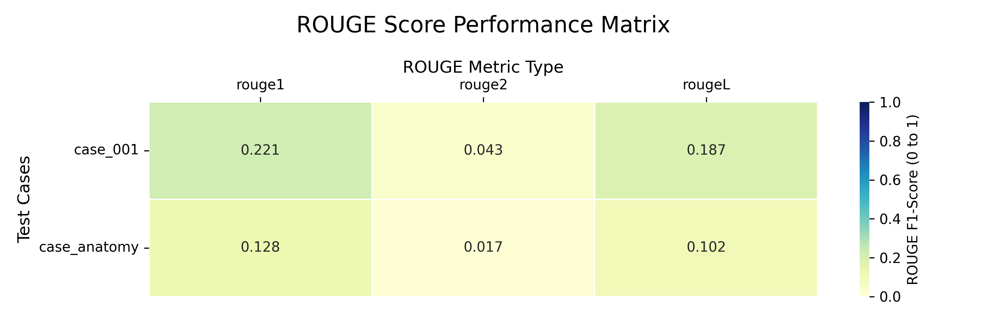

# 240-589 Explainable AI (XAI)
Dentist Assistant for Dental Anatomy Classification
## Author Information
- Name: Wathunyu Phetpaya
- Student Code: 6710120039
- Institution: Prince of Songkla University
- Department: Computer Engineering
- Degree: Master
## Documents
- [SUMMARY.md](https://github.com/wathunyu123/XAI-MINI/blob/main/SUMMARY.md): สรุปทฤษฎี/เทคนิคสำคัญจากรายวิชา
- [Project Directory](https://github.com/wathunyu123/XAI-MINI/tree/main/test): ไฟล์โปรเจคทั้งหมด

