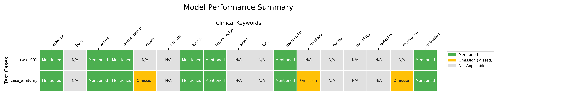

# 240-589 Explainable AI (XAI)
Dentist Assistant for Dental Anatomy Classification
## Author Information
- Name: Wathunyu Phetpaya
- Student Code: 6710120039
- Institution: Prince of Songkla University
- Department: Computer Engineering
- Degree: Master
## Documents
- [SUMMARY.md](SUMMARY.md): สรุปทฤษฎี/เทคนิคสำคัญจากรายวิชา
- [Project Directory](test): ไฟล์โปรเจคทั้งหมด
- [Python Notebook Interface](test/main.ipynb): ไฟล์ไพธอนโน๊ตบุ๊ค
- ผลลัพธ์ทั้งหมดของการทดลองโปรเจค [`Evaluation`](test/evaluation_results) Multi-modal Large Language Model (MLLM)

